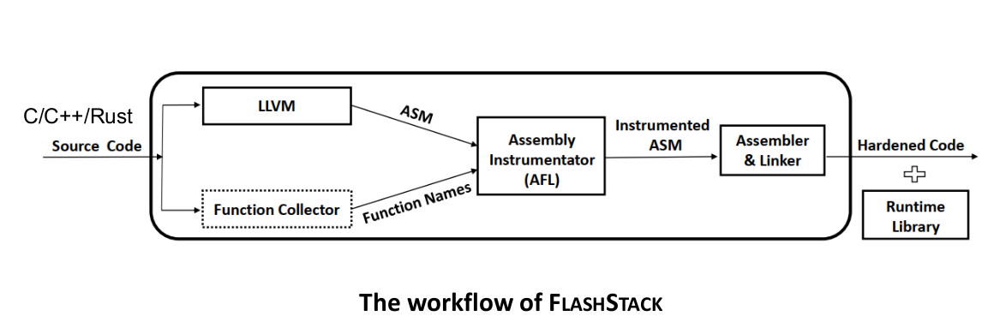

# [FlashStack: Practical Software-Based Shadow Stacks on x86-64](https://dl.acm.org/doi/10.1145/3556977)

**ACM Reference Format**

```
Changwei Zou, Yaoqing Gao, and Jingling Xue.  

Practical Software-Based Shadow Stacks on x86-64. 

ACM Transactions on Architecture and Code Optimization (TACO), Volume 19, Issue 4

https://dl.acm.org/doi/10.1145/3556977

```

## Slides

[Software-Base Techniques for Protecting Return Addresses.pdf](./Software-Based%20Techniques%20for%20Protecting%20Return%20Addresses.pdf)

## Overview

||
|:-------------:|
|  |

## 1. How to Build and Use FlashStack on Your Own Machine from Scratch

```sh
We use LLVM 7.0 and rustc 1.43. 

The following MACRO in FlashStack/spa.h is a switch for instrumenting call instructions.

// direct call / indirect call instrumented
#define    ENABLE_GS_RSP_CALL_INSTRUMENTED
```

#### (1) Install Rustc and Set the Default Version to Be 1.43 

```sh
iron@CSE:~$ curl --proto '=https' --tlsv1.2 -sSf https://sh.rustup.rs | sh

iron@CSE:~$ rustup toolchain install 1.43

iron@CSE:~$ rustup default 1.43

# iron@CSE:~$ rustup self uninstall
```
#### (2) Build FlashStack on Your Own Machine

#####  Open a New Terminal

```sh
iron@CSE:~$ cd github

iron@CSE:github$ pwd

/home/iron/github

iron@CSE:github$ git clone https://github.com/sheisc/FlashStack.git

iron@CSE:github$ cd FlashStack

iron@CSE:FlashStack$ . ./env.sh 

iron@CSE:FlashStack$ ./build.sh
```

#### (3) How to Use FlashStack to Build a Demo Project

#####  Open a New Terminal

```sh
iron@CSE:~$ cd github/FlashStack/

iron@CSE:FlashStack$ . ./runtime.sh 

iron@CSE:FlashStack$ cd demo/

iron@CSE:demo$ make CC=spa-clang CXX=spa-clang++


spa-clang -c main.c -o main.o
spa-cc 0.01
spa-as 0.01

###SPA_FUNCNAME### test

###SPA_FUNCNAME### main
###SPA###  /tmp/main-a98b95.s contains main().
[+] Instrumented 2 locations (2-startproc, 2-endproc, 64-bit, non-hardened mode, ratio 100%).
objdump -d ./main.o

./main.o:     file format elf64-x86-64


Disassembly of section .text:

0000000000000000 <test>:
   0:	4c 8b 1c 24          	mov    (%rsp),%r11
   4:	49 ba 00 00 00 00 00 	movabs $0xffff800000000000,%r10
   b:	80 ff ff 
   e:	65 4e 89 1c 14       	mov    %r11,%gs:(%rsp,%r10,1)
  13:	55                   	push   %rbp
  14:	48 89 e5             	mov    %rsp,%rbp
  17:	48 83 ec 10          	sub    $0x10,%rsp
  1b:	48 bf 00 00 00 00 00 	movabs $0x0,%rdi
  22:	00 00 00 
  25:	b0 00                	mov    $0x0,%al
  27:	e8 00 00 00 00       	callq  2c <test+0x2c>
  2c:	89 45 fc             	mov    %eax,-0x4(%rbp)
  2f:	48 83 c4 10          	add    $0x10,%rsp
  33:	5d                   	pop    %rbp
  34:	49 ba 00 00 00 00 00 	movabs $0xffff800000000000,%r10
  3b:	80 ff ff 
  3e:	48 83 c4 08          	add    $0x8,%rsp
  42:	65 42 ff 64 14 f8    	jmpq   *%gs:-0x8(%rsp,%r10,1)
  48:	0f 1f 84 00 00 00 00 	nopl   0x0(%rax,%rax,1)
  4f:	00 

...

```


#### (4) How to Use FlashStack to Build Nginx

#####  Open a New Terminal

##### (a) Normal Build and Get the Function Names

```sh

iron@CSE:~$ cd github/FlashStack/

iron@CSE:FlashStack$ . ./runtime.sh 

iron@CSE:nginx-1.18.0$ CC="spa-clang -O3" ./configure --prefix=$(pwd)/bin

iron@CSE:nginx-1.18.0$ make -j4 2>&1 | tee ~/nginx.build.txt

iron@CSE:nginx-1.18.0$ cat ~/nginx.build.txt | grep "###SPA_FUNCNAME###" | awk '{printf $2"\n"}' | uniq | sort > /home/iron/nginx.funcnames.txt
```
##### (b) Instrument direct/indirect calls

Once we get the names of the protected functions, we can reuse these names and rebuild Nginx to protect its calls from TOCTTOU attacks.

```sh
iron@CSE:~$ cd github/FlashStack/
iron@CSE:FlashStack$ . ./runtime.sh 

# Change to the directory of nginx-1.18.0 (please download it by yourself)

iron@CSE:nginx-1.18.0$ export __SPA_PROTECTED_FUNCS_PATH=/home/iron/nginx.funcnames.txt
iron@CSE:nginx-1.18.0$ make clean
iron@CSE:nginx-1.18.0$ make -j4

```

##### (c) Function Names for CPU2006, Firefox, HTTPD, and Nginx

```sh
We have provided the following files for CPU2006, Firefox79.0, httpd2.4.46 and nginx1.18 in the source code directory

cpu2006.protected.funcs.txt
firefox79.0.protected.funcs.txt
httpd2.4.46.protected_funcs.txt
nginx1.18.protected_funcs.txt
```

#### (5) How to Use FlashStack to Build Firefox79.0

#####  Open a New Terminal

```sh
To build Firefox79.0, please use the two files WasmSignalHandlers.cpp and SandboxFilterUtil.cpp 
provided to replace the ones in the original Firefox79.0.

The mozconfig is configured as follows:

mk_add_options MOZ_OBJDIR=$topsrcdir/obj.flashstack
mk_add_options MOZ_MAKE_FLAGS="-j4"
ac_add_options --enable-application=browser
ac_add_options CC="spa-clang"
ac_add_options CXX="spa-clang++"
ac_add_options --prefix=$topsrcdir/install.flashstack
ac_add_options --disable-debug-symbols

iron@CSE:~$ cd github/FlashStack/
iron@CSE:FlashStack$ . ./runtime.sh 
# Change to the directory of firefox-79.0 (please download it by yourself)
iron@CSE:firefox-79.0$ ./mach build
```


## 2. How to Reuse the Prebuilt Virtual Machine

#### (1). Download and intall [VMware Workstation Player 15](https://www.vmware.com/products/workstation-player/workstation-player-evaluation.html). 
     
> The free version is available for non-commercial use. 

#### (2). Download the compressed image of our virtual machine [Ubuntu18.04.vmx](https://drive.google.com/file/d/1H1BmYNbAP08QyD_Worm4RXLqWE_DnHLt/view)  and uncompress it.

> FlashStack.7z

#### (3). Use VMware Workstation Player 15 to open the uncompressed virtual machine Ubuntu18.04.vmx.

> The **password** to login is **123456**


#### (4). Follow the steps in Prebuilt.txt


